# Multi-Cloud Infrastructure Hub

<div align="center">

[](https://katsaounisthanasis.github.io/Multi-Cloud-Hub/)
[](https://github.com/KatsaounisThanasis/Multi-Cloud-Hub/actions/workflows/ci.yml)
[](https://github.com/KatsaounisThanasis/Multi-Cloud-Hub/releases)
[](https://opensource.org/licenses/Apache-2.0)
[](https://www.python.org/downloads/)
[](https://reactjs.org/)
[](https://www.terraform.io/)
[](https://www.docker.com/)

[](https://azure.microsoft.com/)
[](https://cloud.google.com/)
[](./templates/)

**A unified platform for deploying and managing cloud infrastructure across Azure and Google Cloud Platform using Infrastructure as Code**

[Website](https://katsaounisthanasis.github.io/Multi-Cloud-Hub/) | [Features](#features) | [Screenshots](#screenshots) | [Quick Start](#quick-start) | [Documentation](#documentation) | [API](#api-endpoints)

<br>

[](https://github.com/KatsaounisThanasis/Multi-Cloud-Hub/stargazers)
[](https://github.com/KatsaounisThanasis/Multi-Cloud-Hub/network/members)

</div>

---

<div align="center">
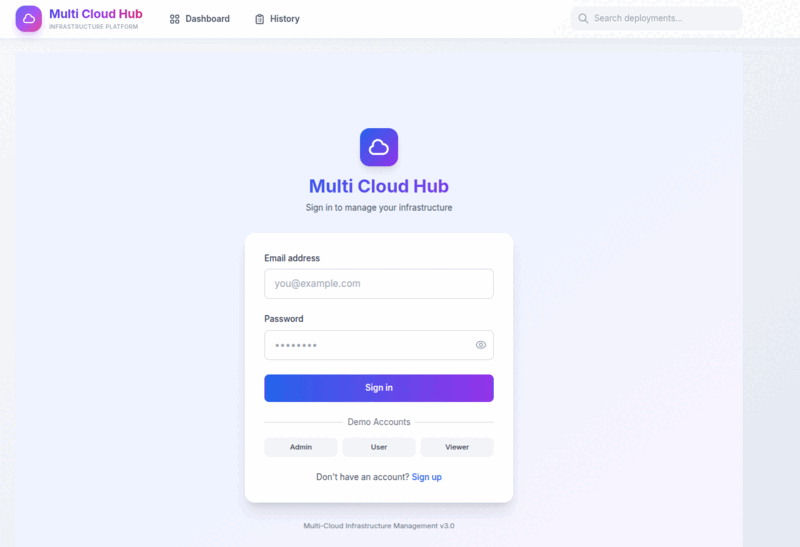
<br><em>See Multi-Cloud Hub in action</em>
</div>

---

## Overview

Multi-Cloud Hub is an enterprise-grade infrastructure management platform that simplifies cloud deployments across multiple providers. Deploy virtual machines, databases, networking, and entire application stacks through a unified interface with pre-built Terraform templates and real-time monitoring.

**Key Benefits:**
- No provider lock-in - deploy to Azure or GCP with a single click
- 35+ production-ready templates
- Real-time cost estimation before deployment
- Live deployment logs and status tracking

---

## Screenshots

<div align="center">

### Dashboard & Monitoring
<p>
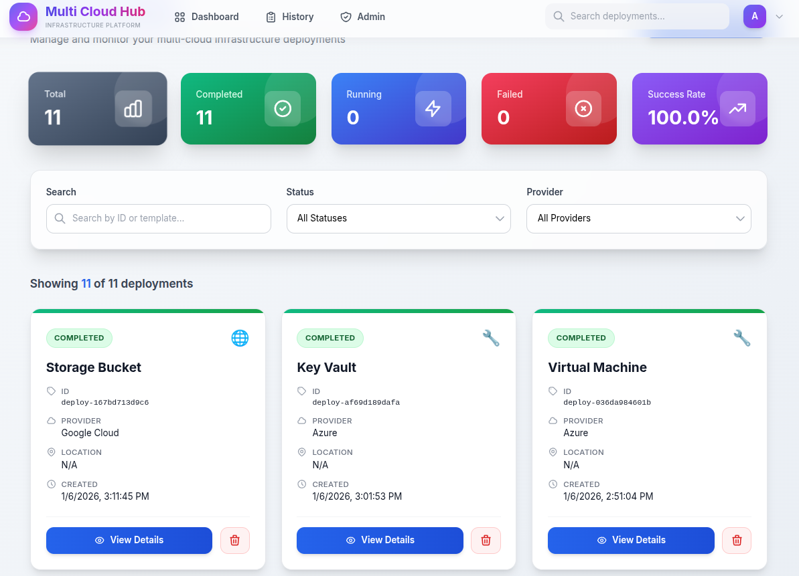
</p>
<p><em>Main dashboard with deployment statistics, success rates, and quick access to all deployments</em></p>

### Service Catalog
<table>
<tr>
<td width="50%">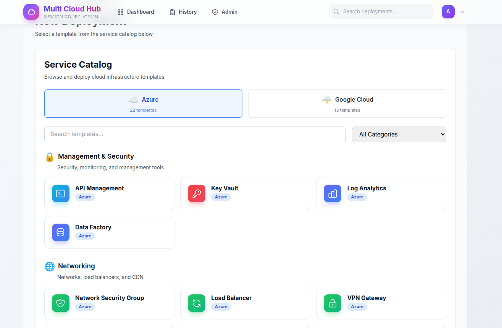</td>
<td width="50%">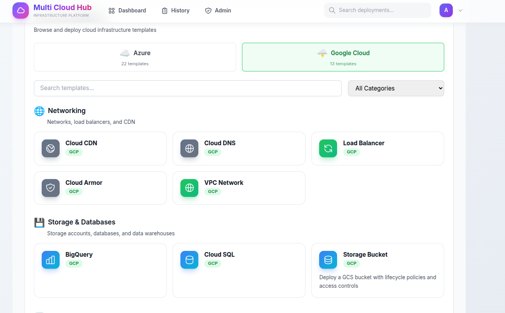</td>
</tr>
<tr>
<td align="center"><em>22 Azure Templates</em></td>
<td align="center"><em>13 GCP Templates</em></td>
</tr>
</table>

### Deployment Workflow
<table>
<tr>
<td width="50%">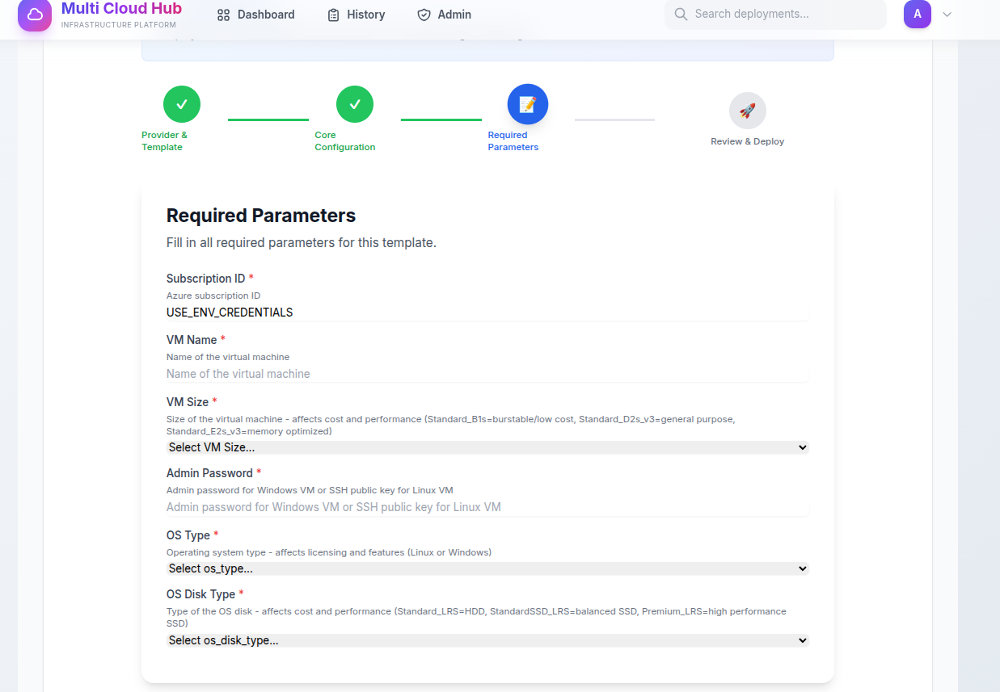</td>
<td width="50%">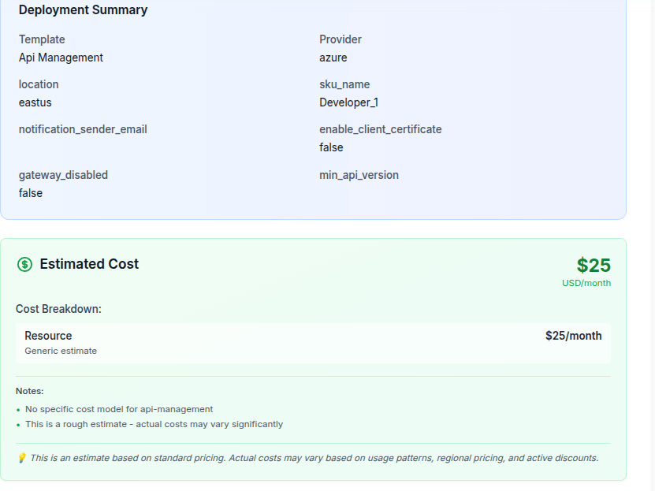</td>
</tr>
<tr>
<td align="center"><em>Step-by-step deployment wizard</em></td>
<td align="center"><em>Real-time cost estimation</em></td>
</tr>
</table>

### Real-time Logs & Details
<table>
<tr>
<td width="50%">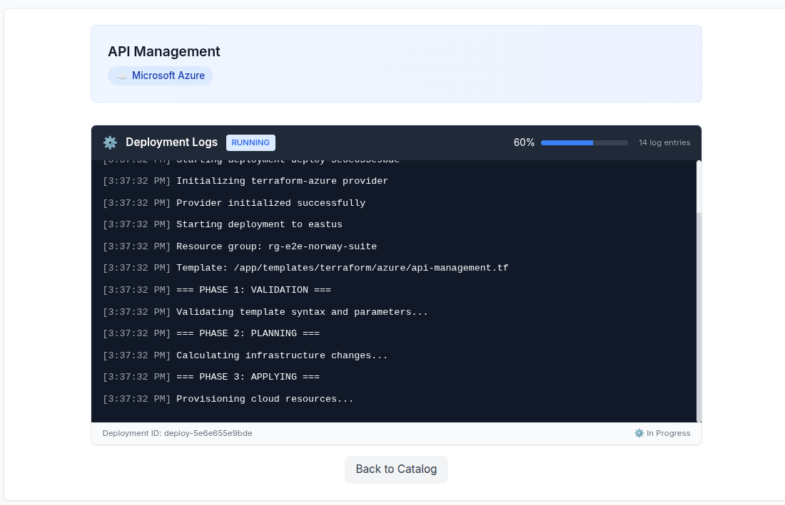</td>
<td width="50%">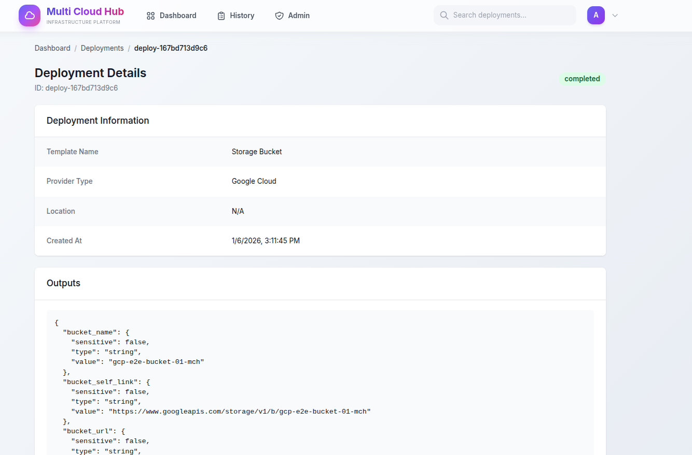</td>
</tr>
<tr>
<td align="center"><em>Live deployment logs with progress</em></td>
<td align="center"><em>Deployment outputs and details</em></td>
</tr>
</table>

### Administration
<table>
<tr>
<td width="50%">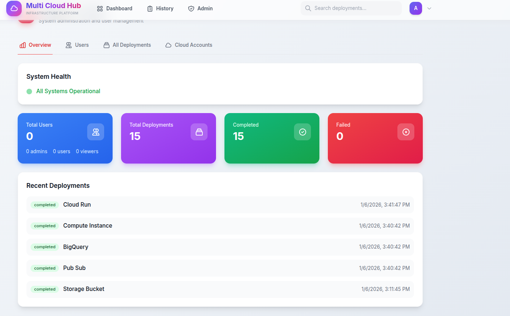</td>
<td width="50%">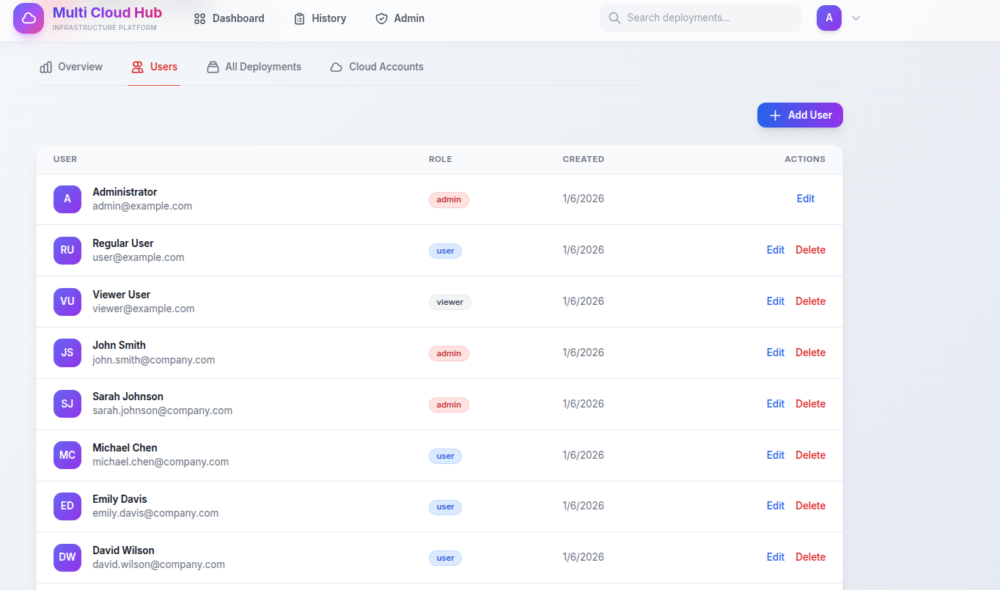</td>
</tr>
<tr>
<td align="center"><em>System health and statistics</em></td>
<td align="center"><em>User management with RBAC</em></td>
</tr>
</table>

### Authentication & Cloud Accounts
<table>
<tr>
<td width="50%">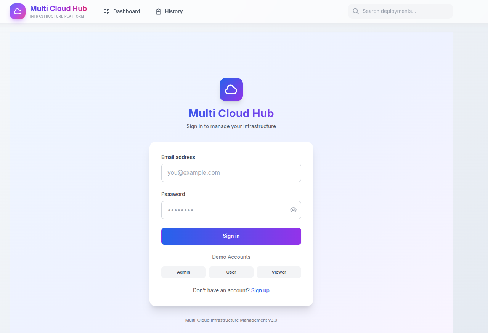</td>
<td width="50%">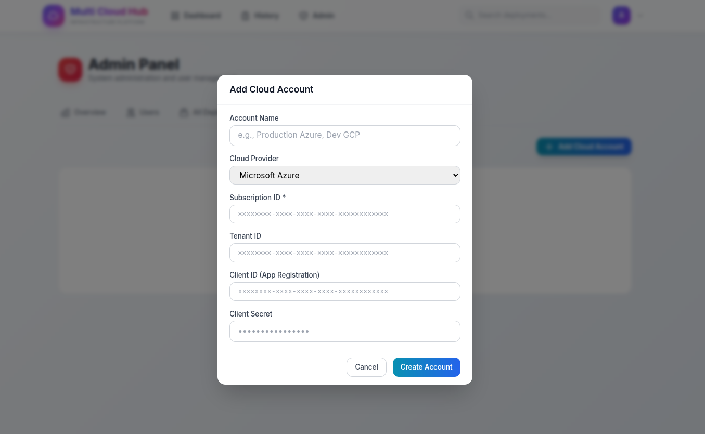</td>
</tr>
<tr>
<td align="center"><em>Secure login with demo accounts</em></td>
<td align="center"><em>Multi-cloud credential management</em></td>
</tr>
</table>

</div>

---

## Features

### Multi-Cloud Deployment
- Deploy infrastructure to **Azure** and **GCP** from one interface
- Provider-agnostic workflow - write once, deploy anywhere
- Seamless provider switching without code modifications

### Infrastructure as Code (IaC)
- **35+ production-ready Terraform templates**
  - 22 Azure templates (VMs, App Services, Databases, Networking)
  - 13 GCP templates (Compute Engine, Cloud SQL, Cloud Run, BigQuery)
- Version-controlled infrastructure definitions
- Full Terraform backend support for state management

### Cost Estimation & Preview
- Real-time cost calculations before deployment
- Estimate monthly/annual costs based on resource configuration
- Detailed cost breakdowns per resource

### Real-time Deployment Monitoring
- Live logs streamed to your browser via SSE
- Track deployment progress step-by-step
- Instant failure alerts with detailed error messages
- Deployment history and status tracking

### Security & Authentication
- JWT-based authentication with secure token management
- Role-based access control (RBAC): Admin, User, Viewer
- Support for managed identities and service principals
- Cloud account permissions per user

### REST API
- Fully-documented REST API for automation and CI/CD
- Programmatic deployment triggers
- OpenAPI/Swagger documentation included

---

## Architecture

```
┌─────────────────────────────────────────────────────────────┐
│                    Frontend (React + Vite)                  │
│       Dashboard | Deployment Wizard | Real-time Logs        │
└─────────────────────────┬───────────────────────────────────┘
                          │ REST API
┌─────────────────────────▼───────────────────────────────────┐
│                 Backend (FastAPI + Python)                  │
│  - Authentication & RBAC     - Cost Calculation Engine      │
│  - Deployment Orchestration  - Real-time Log Streaming      │
│  - Template Management       - Terraform Integration        │
└─────────────────────────┬───────────────────────────────────┘
                          │
            ┌─────────────┼─────────────┐
            │             │             │
            ▼             ▼             ▼
       ┌─────────────┐  ┌─────────┐  ┌───────────┐
       │PostgreSQL   │  │  Redis  │  │  Celery   │
       │ (State)     │  │ (Cache) │  │ (Workers) │
       └─────────────┘  └─────────┘  └─────┬─────┘
                                       │
                          ┌────────────┴────────────┐
                          │                         │
                          ▼                         ▼
                    ┌───────────┐            ┌───────────┐
                    │ Terraform │            │ Terraform │
                    │   Azure   │            │    GCP    │
                    └───────────┘            └───────────┘
```

---

## Quick Start

### Prerequisites

- Docker & Docker Compose
- Azure CLI (for Azure deployments)
- GCP CLI (for GCP deployments)
- Cloud credentials configured

### Installation

```bash
# 1. Clone the repository
git clone https://github.com/KatsaounisThanasis/Multi-Cloud-Hub.git
cd Multi-Cloud-Hub

# 2. Configure your environment
cp .env.example .env
# Edit .env and add your Azure/GCP credentials

# 3. Start the application
docker compose up -d

# 4. Access the application
# Frontend:   http://localhost:5174
# API Docs:   http://localhost:8000/docs
# Admin:      http://localhost:5174/admin
```

### Default Credentials (Development Only)

| Role   | Email              | Password  |
|--------|-------------------|-----------|
| Admin  | admin@example.com | admin123  |
| User   | user@example.com  | user123   |
| Viewer | viewer@example.com| viewer123 |

### First Deployment

1. Navigate to Dashboard
2. Click "New Deployment"
3. Select your cloud provider (Azure or GCP)
4. Choose a template
5. Configure parameters
6. Review cost estimation
7. Deploy and watch logs in real-time

---

## Tech Stack

### Backend
- **FastAPI** - Modern, fast Python web framework
- **Celery** - Distributed task queue for async deployments
- **PostgreSQL** - Deployment state and user data
- **Redis** - Cache and message broker
- **Python 3.11+** - Latest Python runtime

### Frontend
- **React 18** - Component-based UI
- **Vite** - Fast build tool with HMR
- **Tailwind CSS** - Utility-first styling
- **SSE** - Server-Sent Events for real-time logs

### Infrastructure
- **Terraform 1.5+** - Infrastructure as Code
- **Docker** - Containerization
- **Azure SDK** - Azure cloud integration
- **Google Cloud SDK** - GCP cloud integration

---

## API Endpoints

### Authentication
```
POST   /auth/register       Register new user
POST   /auth/login          User login (returns JWT)
GET    /auth/me             Get current user info
GET    /auth/users          List all users (admin only)
```

### Deployments
```
GET    /deployments         List all deployments
POST   /deploy              Create new deployment
GET    /deployments/{id}    Get deployment details
GET    /deployments/{id}/logs  Stream deployment logs (SSE)
DELETE /deployments/{id}    Delete deployment record
```

### Templates
```
GET    /templates           List all templates
GET    /templates/{provider}/{name}  Get template details
GET    /templates/{provider}/{name}/parameters  Get template parameters
```

### Cost Estimation
```
POST   /cost/estimate       Calculate deployment cost
```

### Health
```
GET    /health              API health check
GET    /health/detailed     Detailed system status
```

Full API documentation available at `http://localhost:8000/docs` when running.

---

## Project Structure

```
Multi-Cloud-Hub/
├── backend/
│   ├── api/              # FastAPI routes and schemas
│   ├── core/             # Auth, security, config
│   ├── providers/        # Terraform provider integration
│   ├── services/         # Business logic
│   └── tasks/            # Celery async tasks
├── frontend-v3/
│   ├── src/
│   │   ├── components/   # React components
│   │   ├── pages/        # Page components
│   │   ├── contexts/     # React contexts
│   │   └── api/          # API client
│   └── public/
├── templates/
│   └── terraform/
│       ├── azure/        # 22 Azure templates
│       └── gcp/          # 13 GCP templates
├── tests/
│   ├── unit/             # Unit tests
│   └── integration/      # Integration tests
├── docs/                 # Documentation
├── docker-compose.yml    # Docker orchestration
└── README.md
```

---

## Documentation

| Document | Description |
|----------|-------------|
| [Quick Start](docs/QUICK_START.md) | Setup and first deployment |
| [Architecture](docs/ARCHITECTURE.md) | System design and components |
| [API Reference](docs/API_REFERENCE.md) | REST API documentation |
| [Credentials Setup](docs/CREDENTIALS_SETUP.md) | Cloud provider authentication |
| [Deployment Guide](docs/DEPLOYMENT_GUIDE.md) | Production deployment |
| [Security](docs/SECURITY.md) | Security practices |
| [Contributing](docs/CONTRIBUTING.md) | Contribution guidelines |
| [Changelog](docs/CHANGELOG.md) | Version history |

---

## Development

### Local Development

```bash
# Backend (requires Python 3.11+)
cd backend
pip install -r requirements.txt
uvicorn backend.api.app:app --reload

# Frontend (requires Node.js 18+)
cd frontend-v3
npm install
npm run dev

# Celery Worker
celery -A backend.tasks.celery_app worker --loglevel=info
```

### Running Tests

```bash
# All tests
pytest

# With coverage
pytest --cov=backend --cov-report=html

# Specific test file
pytest tests/unit/test_auth.py -v
```

### Docker Development

```bash
# Build and start all services
docker compose up -d --build

# View logs
docker compose logs -f api

# Rebuild specific service
docker compose build api --no-cache
docker compose up api -d
```

---

## Roadmap

- [ ] AWS support (EC2, S3, RDS, Lambda)
- [ ] Kubernetes deployments (EKS, GKE, AKS)
- [ ] Enhanced cost optimization recommendations
- [ ] Policy-as-Code (OPA/Sentinel)
- [ ] Multi-region deployment strategies
- [ ] GitOps integration
- [ ] Slack/Teams notifications

---

## Contributing

Contributions are welcome! Please see [CONTRIBUTING.md](docs/CONTRIBUTING.md) for guidelines.

1. Fork the repository
2. Create a feature branch (`git checkout -b feature/amazing-feature`)
3. Commit your changes (`git commit -m 'Add amazing feature'`)
4. Push to the branch (`git push origin feature/amazing-feature`)
5. Open a Pull Request

---

## License

This project is licensed under the **Apache License 2.0** - see the [LICENSE](LICENSE) file for details.

---

## Support

- **Documentation**: Check the [docs/](docs/) directory
- **Issues**: Open an issue on [GitHub](https://github.com/KatsaounisThanasis/Multi-Cloud-Hub/issues)
- **Discussions**: Join community discussions on GitHub

---

<div align="center">

**Built by Thanasis Katsaounis**

[Report Bug](https://github.com/KatsaounisThanasis/Multi-Cloud-Hub/issues) | [Request Feature](https://github.com/KatsaounisThanasis/Multi-Cloud-Hub/issues)

</div>
